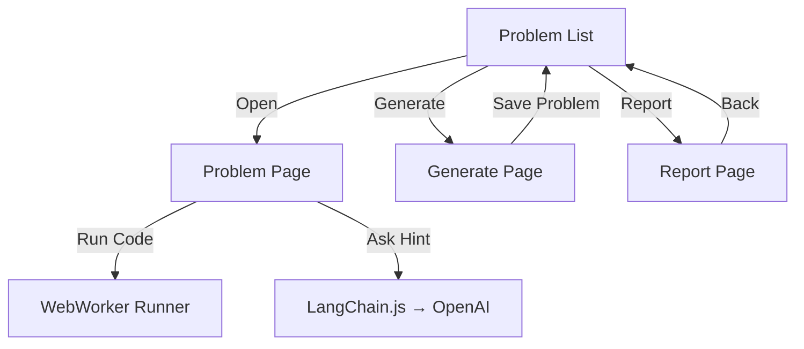
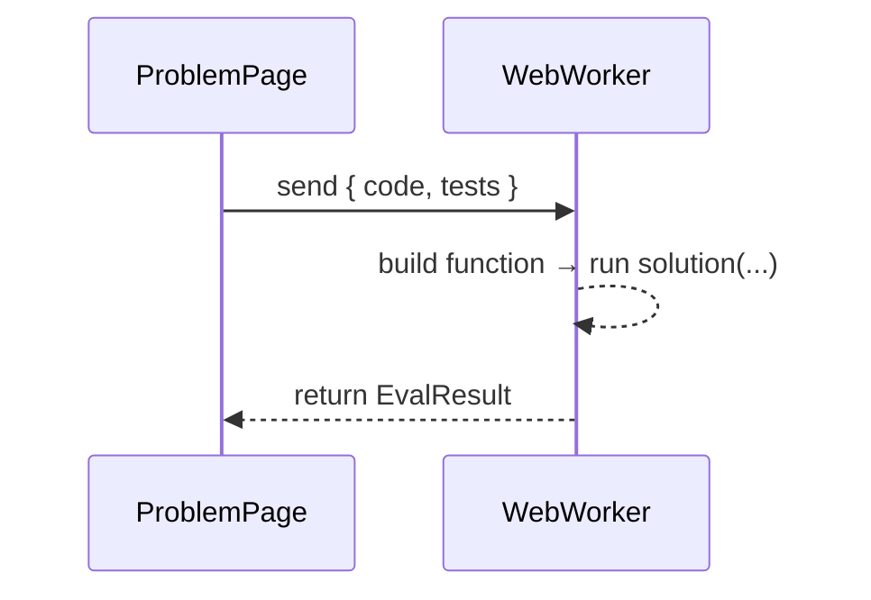

# MeetCode — Generative AI Code Learning App

> A **frontend-only**, LeetCode-style practice app powered by **Generative AI**.  
> Learn algorithms and data structures with **AI-generated problems, hints, and personalized coaching reports**.  
> Built with **React + TypeScript + Vite**, **Monaco Editor**, **WebWorker test runner**, and **LangChain.js** (in-browser).

  

---

## ✨ Features

- 🎯 **LeetCode-style UI** → Problems list, detail page, Monaco editor, tests, hints.
- ⚡ **Frontend-only** → Easy to host (Vercel, Netlify, GitHub Pages).
- 🧑‍💻 **Monaco Editor** with TypeScript/JavaScript.
- 🔒 **Safe code execution** in browser using **WebWorkers** (JS/TS only).
- 🤖 **AI in-browser (LangChain.js)**:
  - Generate new problems (topic + difficulty).
  - Provide tailored hints for user’s attempt.
  - Summarize performance with AI coaching report.
- 💾 **LocalStorage persistence** → problems, attempts, and reports saved locally.

---

## 🧭 Demo Flow



---

## 🧱 Architecture

```mermaid
flowchart LR
  subgraph Browser[MeetCode SPA]
    UI[React UI <br/>(ProblemList, ProblemPage, Report)]
    Store[Zustand + LocalStorage]
    Editor[Monaco Editor]
    Worker[WebWorker Runner <br/>(JS/TS)]
    LC[LangChain.js Client <br/>(OpenAI API)]
  end

  UI --> Store
  UI --> Editor
  UI <--> Worker
  UI <--> LC
  Store <--> LS[(localStorage)]

  LC -->|HTTPS| OpenAI[(OpenAI API)]

```

- **No backend** — all AI and execution runs in the browser.
- **LocalStorage** keeps problems, attempts, API key, and progress.
- **WebWorker** ensures code runs safely in isolation.

---

## 📁 Project Structure

```
meetcode/
├─ src/
│  ├─ components/         # UI Components
│  │   ├─ ProblemList.tsx
│  │   ├─ ProblemPage.tsx
│  │   ├─ GeneratePage.tsx
│  │   ├─ ReportPage.tsx
│  │   └─ CodeEditor.tsx
│  ├─ lib/
│  │   ├─ types.ts        # Shared types
│  │   ├─ problems.ts     # Seed problems
│  │   ├─ storage.ts      # LocalStorage helpers
│  │   └─ langchain.ts    # LangChain.js client
│  ├─ lib/runner/
│  │   ├─ index.ts        # runInWorker(...)
│  │   └─ worker.ts       # sandboxed test runner
│  ├─ state/
│  │   └─ useStore.ts     # Zustand state
│  ├─ App.tsx
│  └─ main.tsx
├─ index.html
├─ vite.config.ts
├─ tsconfig.json
└─ package.json
```

---

## 🧩 Core Types

```ts
export type Difficulty = 'EASY' | 'MEDIUM' | 'HARD'
export type Lang = 'ts' | 'js'

export interface Problem {
  id: string
  slug: string
  title: string
  difficulty: Difficulty
  topics: string[]
  prompt: string
  constraints?: string
  examples: { input: unknown[]; output: unknown }[]
  starterCode: Record<Lang, string>
  tests: { name: string; input: unknown[]; output: unknown }[]
}

export interface EvalResult {
  passed: number
  total: number
  details: { name: string; status: 'pass' | 'fail' | 'error'; info?: string; runtimeMs: number }[]
  verdict: 'ACCEPTED' | 'WRONG_ANSWER' | 'RUNTIME_ERROR' | 'TLE'
}

export interface UserReport {
  solved: number
  attempts: number
  passRate: number
  weakTopics: string[]
  aiSummary: string
}
```

---

## 🧪 Test Runner



- Requires exported function:  
  ```ts
  export function solution(input: any): any { ... }
  ```

---

## 🧠 AI Interactions (LangChain.js)

### Generate Problem
```text
System: You generate LeetCode-style problems. Output ONLY JSON.
User: Create a MEDIUM problem about Linked Lists. Return:
{ title, slug, difficulty, topics, prompt, examples, starterCode, tests }
```

### Get Hint
```text
Give a 2–3 sentence hint for this problem attempt. Do not reveal solution.
```

### Report Summary
```text
Summarize in 4–6 sentences coaching advice for:
{ solved, attempts, passRate, weakTopics }
```

---

## 🚀 Getting Started

```bash
npm install
npm run dev
```

Visit [http://localhost:5173](http://localhost:5173).

---

## 🌐 Deployment

- **Vercel / Netlify** → import repo, defaults work.
- **GitHub Pages**:
  ```bash
  npm run build
  npm run deploy
  ```

---

## 📊 Roadmap

- [ ] Add Settings modal to manage API key.  
- [ ] Multi-hint levels (basic → detailed).  
- [ ] Track coding time per attempt.  
- [ ] Add more languages (via Pyodide for Python).  
- [ ] Import/export problems as JSON.  

---

## 📜 License

MIT © 2025 — MeetCode Team
